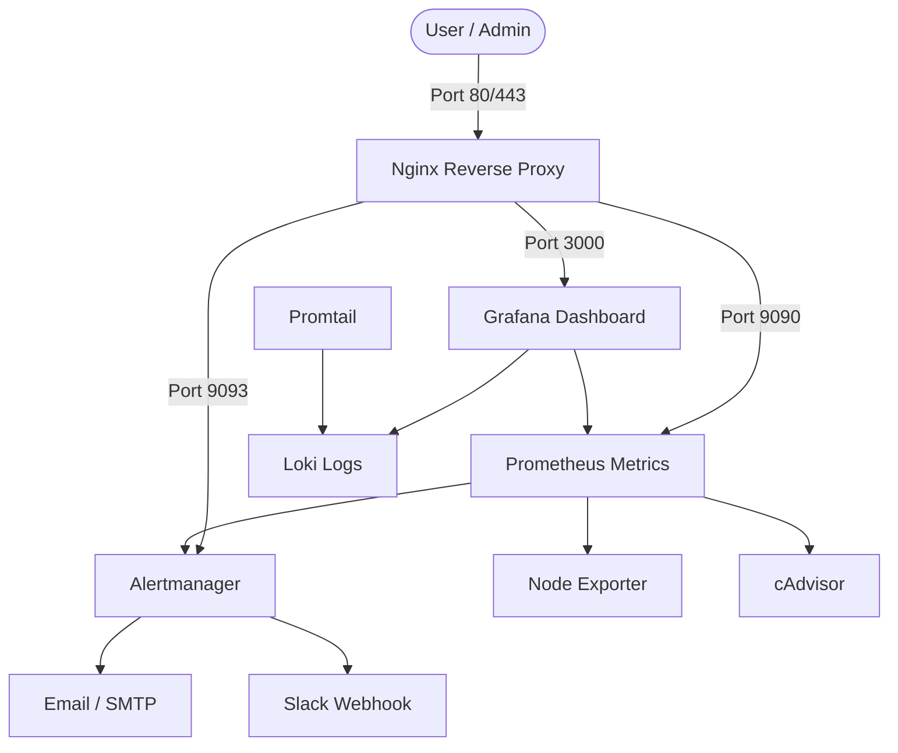

# 🛡️ System Monitoring & Alerting Platform

A production-ready monitoring, log aggregation, and alerting stack built with **Docker Compose**, **Prometheus**, **Loki**, **Grafana**, **Alertmanager**, and an integrated **Nginx Reverse Proxy** gateway.

---

## 🏗️ Architecture

The stack consists of collection agents (exporters), log shippers, central storage databases, a visualization dashboard, and a secure front-facing reverse proxy.



---

## 🚀 Services & Ports

Once running, the services can be accessed securely through Nginx or directly (if configured):

| Service | Internal Port | External Path / URL | Purpose |
| :--- | :---: | :--- | :--- |
| **Nginx** | `80`, `443` | `http://localhost/` | Secure edge gateway & SSL termination |
| **Grafana** | `3000` | `http://localhost/grafana` | Single pane of glass for dashboards & logs |
| **Prometheus** | `9090` | `http://localhost/prometheus` | Metric collection and alert evaluation |
| **Alertmanager** | `9093` | `http://localhost/alertmanager` | Routing, silencing, and grouping alerts |
| **Loki** | `3100` | *Internal Only* | High-efficiency log database |
| **Promtail** | `9080` | *Internal Only* | Scrapes host/container logs and ships to Loki |
| **Node Exporter**| `9100` | *Internal Only* | System hardware metrics (CPU, RAM, Disk) |
| **cAdvisor** | `8080` | *Internal Only* | Docker container resource usage metrics |

---

## ⚙️ Quick Start

### 1. Configure Secrets
1. Copy the environment template:
   ```bash
   cp .env.example .env
   ```
2. Open `.env` and fill in your configuration:
   - Email/SMTP credentials for notifications
   - Slack webhook URL and alert channel
   - Grafana default admin password

### 2. Deploy the Stack
Start all services in the background using the Makefile:
```bash
make up
```
This automatically compiles environment variables into the Alertmanager configuration and starts the containers.

---

## 🔒 Nginx Reverse Proxy & SSL (High-Level)

Nginx is designated as the secure gateway of the stack. By funneling all traffic through Nginx:
*   **Single Port Access**: You only need to expose public ports `80` (HTTP) and `443` (HTTPS) to the outside world, keeping the underlying service ports (`3000`, `9090`, `9093`) private.
*   **Path/Subdomain Routing**: Incoming requests are reverse-proxied transparently to the corresponding backend service (e.g., routing `monitor.example.com/grafana` to `grafana:3000`).
*   **SSL/TLS Termination**: Nginx can easily handle HTTPS encryption using Let's Encrypt (Certbot) certificates, ensuring all dashboards and configurations are encrypted in transit.

---

## 🔔 Alerting & Logs

*   **Alert Rules (`prometheus/alert_rules.yml`)**: Pre-configured alerts monitor system CPU (>80%), Memory (>75%), Disk (>90%), instance reachability, and container restarts.
*   **Routing Logic**: Warning alerts are routed to **Slack** to prevent inbox fatigue, while Critical alerts go to both **Slack** and **Email**.
*   **Log Ingestion**: Promtail automatically tails host logs in `/var/log` and active Docker container output, shipping them to Loki to be analyzed alongside metrics inside Grafana.

---

## 🛠️ Management Commands

| Command | Action |
| :--- | :--- |
| `make up` | Start the stack in background |
| `make down` | Stop the stack |
| `make restart` | Restart all services |
| `make ps` | List active containers |
| `make logs` | Tail real-time service logs |
| `make clean` | Stop stack and erase all data volumes |
